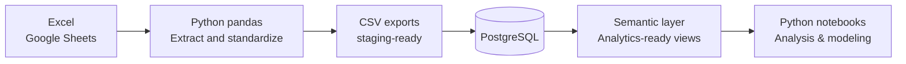

# SC01 — From Excel-Based Analysis to a Reproducible SQL Analytics Model

> **Rebuilding data trust by replacing fragmented spreadsheet analytics with a unified, validated SQL-based analytical foundation.**

---

## Executive Summary

This study case documents the shift from fragile, spreadsheet-based analytics to a reproducible SQL analytics model built for engineering-grade decisions. 

The original environment relied on disconnected spreadsheets with manual logic and weak validation, making results technically indefensible. The problem was not modeling capability, but data uncertainty. 

SC01 introduces a layered PostgreSQL model with explicit semantic contracts and a curated semantic layer that serves as a stable analytical interface, enabling all downstream studies (SC02–SC05) to be comparable, reproducible, and defensible.

---

## 1. Why This Study Case Exists

### From Fragmented Spreadsheets to Analytical Risk

In the original operation, metallurgical data was distributed across **10+ active workbooks with 20+ sheets**, maintained independently by different production areas. These files supported daily monitoring, SPC, traceability, and ad-hoc analysis.

Over time, this approach became structurally fragile:

**Why spreadsheets failed at scale**
- Fragmented sources made joins manual and error-prone  
- Minimal validation allowed duplicates and inconsistencies to accumulate  
- Formulas drifted as files were copied and modified  
- Performance degraded and corruption risk increased  
- No temporal traceability of how data evolved  
- Analyses were non-reproducible by construction  

The deeper issue was not analytical sophistication but **data uncertainty**. Analyses appeared quantitative, yet rested on foundations that could not be defended technically.

### Rebuild, Not Optimize

The objective was not to improve spreadsheet workflows, but to **replace the system entirely**:

- **From:** Multiple workbooks → **To:** Single PostgreSQL source of truth  
- **From:** Manual logic → **To:** Explicit SQL transformations  
- **From:** Implicit assumptions → **To:** Enforced constraints  
- **From:** Temporal ambiguity → **To:** Versioned, traceable data  
- **From:** Indefensible results → **To:** Auditable analytics  

This required reconstructing the analytical base from first principles:
- Canonical data model with explicit semantics and grain  
- Separation of specifications, measurements, and transformations  
- Centralized validation and integration rules  
- One authoritative definition per analytical entity  

The goal was to make analysis defensible **before** decisions were defended.

---

## 2. Scope of This Study Case

SC01 documents the **analytical interface** produced by this reconstruction: the semantic layer and its consumption patterns.

**Portfolio scope**
- Semantic layer design (5 stable views)  
- Explicit grain and data contracts  
- Reproducible analytical consumption  
- Foundation enabling credible downstream modeling  

**Production scope (out of portfolio)**
- Full ETL pipelines  
- Real-time validation and monitoring  
- Historical reconstruction and audit trails  

**This distinction matters:** downstream study cases demonstrate analytical value; the production system ensures operational robustness. SC01 focuses on the **analytical foundation** that makes modeling trustworthy.

---

## 3. Role Within the Portfolio

**SC01 is not an isolated data engineering exercise**—it is the **enabling layer** for all subsequent study cases:

- **SC02:** Chemistry-only signal validation for UTS  
- **SC03:** Generalization across alloy systems  
- **SC04:** Incremental value of process variables  
- **SC05:** Uncertainty-aware design tools  

Without stable data semantics, models lack credibility. With them, analytical conclusions become comparable, reproducible, and defensible.

---

## 4. Problem Framing and Hypothesis

### Strategic Problem

Spreadsheet-based analytics do not scale for engineering decisions because they lack:

- **Stability:** Semantic definitions drift as formulas are copied and modified
- **Validation:** Constraints are enforced inconsistently or not at all
- **Reproducibility:** The same analysis performed on "current" data may yield different results
- **Traceability:** It's impossible to know what version of data was used or how it evolved

This introduces hidden analytical risk: results appear objective but cannot be defended.

### Hypothesis

> *A layered SQL analytics model with explicit data contracts and a curated semantic layer can replace spreadsheet wrangling with stable, reproducible analytical consumption.*

---

## 5. Architectural Approach

The solution implements a **layered analytics pipeline** with clear separation of concerns.

**Figure 1 — Analytical data flow**



> Internally, the PostgreSQL analytics model uses layered data semantics that are abstracted from analysts, who interact only with the semantic layer to ensure centralized corrections, upstream validation, and consistent downstream analysis.

A more detailed architectural view is provided in [`docs/architecture.md`](docs/architecture.md).

---

## 6. Semantic Layer as Analytical Interface

The semantic layer is the **product surface** of the analytics model.

**Table 1 — Core semantic views**

| View | Grain | Purpose |
|-----|------|---------|
| `v_heats_by_alloy` | 1 per heat | Alloy segmentation |
| `v_lab_values_by_heats` | 1 per (heat, test, session) | Mechanical results |
| `v_heats_by_final_product` | 1 per heat | Product metadata |

**Key principle:** each view has an explicit, documented **grain contract**.

For detailed catalog and example queries, see [`docs/semantic_layer.md`](docs/semantic_layer.md).

---

## 7. Analytical Consumption Pattern

Standard workflow:
1. Query only required semantic fields  
2. Join at heat level using stable keys  
3. Light reshaping only (e.g., pivots)  
4. No manual deduplication or correction  

Example SQL extract:

```sql
select
  alloy.alloy_code,
  chem.element_symbol,
  chem.element_value,
  lab.test_value as uts_mpa,
  product.base_temper
from v_heats_by_alloy alloy
join v_chem_by_heats chem
  on chem.heat_num = alloy.heat_num
  and chem.session_type = 'drop_analysis'
join v_lab_values_by_heats lab
  on lab.heat_num = alloy.heat_num
  and lab.test_name = 'UTS'
join v_heats_by_final_product product
  on product.heat_num = alloy.heat_num
where chem.element_symbol in ('Si', 'Fe');
```

## 8. Evidence of Consumption

A demonstration notebook shows semantic layer usage:

- Stable joins with preserved grain  
- Fast segmentation and summaries  
- Sanity checks confirming expected behavior  

The notebook is intentionally simple; its purpose is to validate **consumption patterns**, not to perform advanced modeling.

**Notebook:** [`notebooks/01_sql_semantic_layer_consumption.ipynb`](notebooks/01_sql_semantic_layer_consumption.ipynb)

---

## 9. Impact

### Analytical Impact

- **Reproducibility:** The same analysis code produces identical results regardless of when it is run
- **Consistency:** All analyses use the same definitions of grain, chemistry, temper, customer segment
- **Efficiency:** Analysts spend time on analysis, not data wrangling or chasing down where a number came from
- **Auditability:** Data transformations are centralized in SQL, not scattered across notebooks or spreadsheets

### Operational Impact

- **Data quality:** Constraints and validation rules are enforced at ingestion, not discovered during analysis
- **Performance:** A single PostgreSQL instance replaces dozens of spreadsheets and manual merge operations
- **Traceability:** Every analytical dataset can be traced back to source views, timestamps, and versions

### Portfolio Impact

By establishing stable, validated data semantics, **SC01 enables downstream studies to be credible:**
- Models trained on clean, consistent data reflect genuine signal, not data artifacts
- Results can be compared across studies and time periods
- Standards derived from modeling can be trusted by engineering teams
- Analytical conclusions rest on defensible foundations

---

## 10. Guardrails and Limitations

- Public repo uses CSV exports; production uses live views  
- Schema evolution requires semantic updates (by design)  
- Grain is heat-level; no time-series logic  
- No extrapolation beyond observed domains  

---

## 11. Connection to Downstream Studies

SC01 establishes the analytical interface that enables SC02–SC05 to ask meaningful questions about signal, robustness, and uncertainty.

Without SC01, results would be questionable.  
Without production rigor, SC01 would not scale.

Together, they demonstrate a **coherent analytical-operational system**.

---

## References and Documentation

- Portfolio assumptions and conventions:  
  → [`README_EXTENDED.md`](https://github.com/ivvza-io/analytics-engineering-portfolio/blob/main/docs/README_EXTENDED.md)
- High-level architecture and data flow rationale:  
  → [`docs/architecture.md`](docs/architecture.md)
- Complete semantic layer catalog and grain contracts:   
  → [`docs/semantic_layer.md`](docs/semantic_layer.md)
- Semantic layer usage notebook:  
  → [`notebooks/01_sql_semantic_layer_consumption.ipynb`](notebooks/01_sql_semantic_layer_consumption.ipynb)

## How to Run This Study Case
  Reproducibility instructions are provided in:   
  → [`HOW_TO_RUN.md`](HOW_TO_RUN.md)
