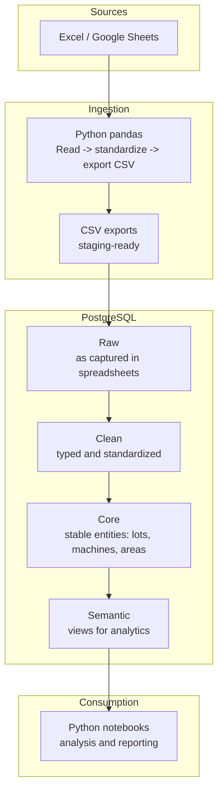

# Architecture Overview

This document describes the high-level architecture of the analytics pipeline implemented in this case study.  
The focus is on clarity, separation of responsibilities, and reproducibility rather than on low-level implementation details.

---

## High-Level Architecture

## Architecture Principles

The architecture was designed around the following principles:

- Single source of truth
PostgreSQL acts as the authoritative layer where data consistency, structure, and business rules are enforced.

- Clear separation of concerns
Data extraction, transformation, modeling, and consumption are handled in distinct stages to reduce coupling and complexity.

- SQL-first transformations
All core transformations and validations are implemented in SQL, ensuring consistent logic across all analytical use cases.

- Analytics-ready design
A semantic layer exposes curated views and tables optimized for analytical consumption, minimizing downstream data preparation.

- Reproducibility over convenience
The pipeline prioritizes repeatable and deterministic results rather than ad-hoc or manual workflows.

## Data Flow Description

### 1. Source data

Operational and quality data originates from Excel and Google Sheets used during production and analysis activities.

### 2. Ingestion

Python and pandas are used to:

- read spreadsheet data
- standardize formats (dates, times, column names)
- export staging-ready CSV files

This step isolates extraction logic from database transformations.

### 3. Raw layer

The raw layer mirrors the structure of the original spreadsheets, preserving the data as captured while providing traceability.

### 4. Clean layer

Data is standardized, typed, and validated:

- duplicates are removed
- constraints are enforced
- invalid records are detected early

Only validated data progresses further into the model.

### 5. Core layer

Stable entities that exist independently of analytical use cases (such as lots, machines, and production areas) are modeled here.

This layer provides a consistent backbone for all downstream analysis.

### 6. Semantic layer

Analytical views and tables are built to reflect common analytical questions, exposing data at well-defined grains and with consistent definitions.

### 7. Consumption

Python notebooks consume the semantic layer to perform:

- exploratory data analysis
- pivots and aggregations
- reporting and visualization

## Why This Architecture Works

- New data can be added without breaking existing analysis
- Analytical logic is centralized and reusable
- The model can evolve as processes or analytical needs change
- Analysts interact with curated datasets instead of raw operational data

This structure supports both day-to-day analysis and long-term analytical growth.
